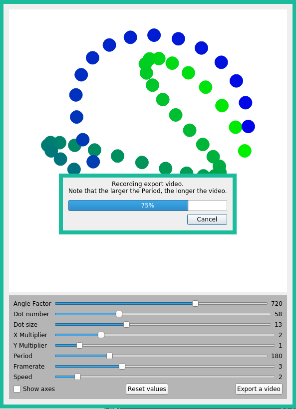

# Captivox

make a whole lot of cool dot animations using the Power of Parametric™ Maths™ Equations

I want to try!
-----
Just run `pip install --user PyQt5` and then `python3 captivox.py`.

Optionally, run `pip install --user imageio` and ensure you have `ffmpeg` on your computer if you want to export videos. To install both in one command, use `pip install --user -r requirements.txt`.

Oh, and be sure to use pip for python3, not python2. This project is python3 only. This might mean using `pip3` instead of `pip`.

What does it look like?
-----

Like this!

Can I contribute?
-----

the code is in `captivox.py`, you're welcome to make pull requests. I know I'm not the best designer in the world so I would especially welcome improvements in that area.

Final notes
-----

When exporting video, beware that the result will look a lot faster than it does when you're playing around with it. This is because when displaying live, there is an extra delay to actually render each frame before it is shown, but in the video the frames are all pre-rendered and thus it appears much faster. You may want to increase 'delay' to compensate.

Also, if you **really** want a GIF instead of an mp4, despite the larger filesize and worse quality, you can use `ffmpeg` to convert it (some variant of `ffmpeg -i captivox.mp4 out.gif`).
